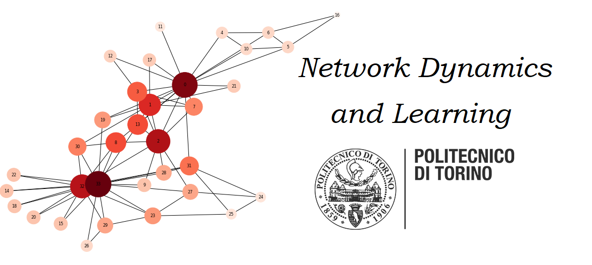

# Network-Dynamics-and-Learning

Homework and laboratories of the [Network Dynamics and Learning](https://didattica.polito.it/pls/portal30/gap.pkg_guide.viewGap?p_cod_ins=01TXLSM&p_a_acc=2021&p_header=S&p_lang=IT) course for the MSc in Data Science and Engineering at Politecnico di Torino.

## Homework 1:
This homework deals with connectivity, network flows and user equilibria in traffic networks applied to the LA highway network.
## Homework 2:
Study how the model an opinion dynamics and convergence to consensus. Markov chains are also used to simulate the movement of particles in a network.
## Homework3 3:
 During the fall of 2009 there was a large pandemic of the H1N1-virus, commonly known as the swine-flu. 
During this pandemic it is estimated that about 1.5 million people in Sweden were infected. 
As an attempt to stop the pandemic and reduce excess mortality the government issued a vaccination program beginning in week 40 of 2009. 
During the weeks that followed they vaccinated more than 60% of the Swedish population.
The aim of this homewrok is to simulate the pandemic with the goal of learning the networkstructure characteristics and disease-dynamics parameters of the pandemic in Sweden 2009.
This task will be divided into 4 parts where the focus of each part is to:
1. get started and learn how to:
a. simulate a pandemic on a known graph;
b. generate a random graph;
2. simulate the disease propagation on a random graph without vaccination;
3. simulate disease propagation on a random graph with vaccination;
4. estimate the network-structure characteristics and disease-dynamics parameters for the
pandemic in Sweden during the fall of 2009.
All numbers regarding the H1N1 pandemic in Sweden during the fall of 2009 have been taken
from the a report by the Swedish Civil Contingencies Agency (Myndigheten f¨or samh¨allsskydd
och beredskap, MSB) and the Swedish Institute for Communicable Disease Control (Smittskyddsinstitutet, SMI).

All simulations are written in Python Notebook and use the NetworkX library.
